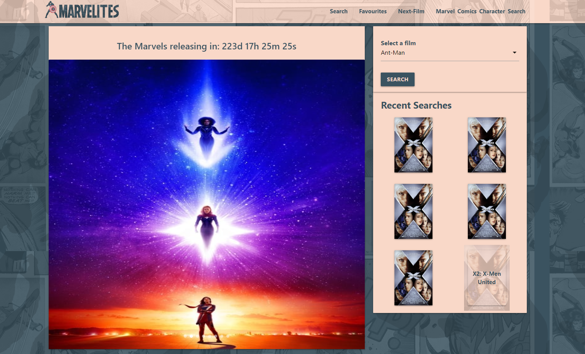
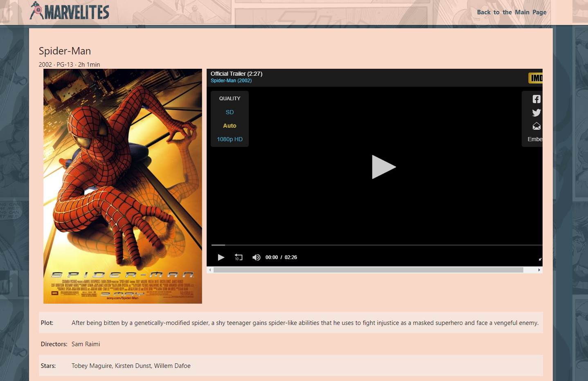
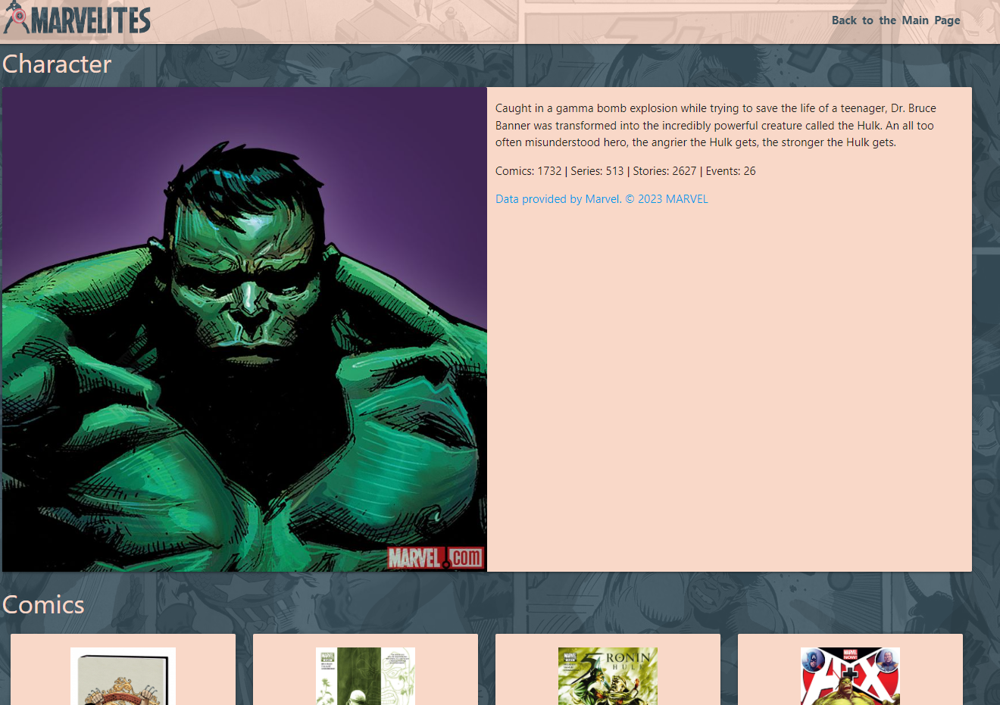

# Marvelites Fan Page

## Project Description

We saw the opportunity to use IMDb and Marvel API to build a centralized location which allows Marvel fans, our users, to read about any upcoming Marvel releases, explore projects that have already been released, and also to dig deeper into the comic book origins of their favourite Marvel characters, and discover how these characters cross-pollinate into other stories.

## Links

Have a look at our live page at [live page](https://voi-jankowski.github.io/marvel/) And here you can find the code for this project: [GitHub](https://github.com/voi-jankowski/marvel)

## Usage

Open the page and you can find the carousel with several upcoming films each with the countdown clock until its premiere. Scroll around and pick one that catches your eye and click it to get more info.

On the right there is a search box, where you can select desired titles from the dropdown search. When you click SEARCH you will be presented with info on that film and its trailer.

Select the link on the nav-bar for Marvel Comics Character Search to get more knowledge on the characters from the films and see what stories they were part of.

## Credits

The page was created by:

Grethel Reyes- [Grethel's Github](https://github.com/Garethus)

Jasmine Neal- [Jasmine's Github](https://github.com/Jvn101)

Dominic Vickery- [Dom's Github](https://github.com/DominicVN)

Solution for the dropdown search was sourced at [Codepen](https://codepen.io/yassinevic/pen/eXjqjb)

Framework used: Materialize v1.0.0 [Materialize Webpage](http://materializecss.com) Copyright 2014-2017 Materialize

MIT License [LICENSE](https://raw.githubusercontent.com/Dogfalo/materialize/master/LICENSE)

## License

Please refer to the LICENSE in the repo.
